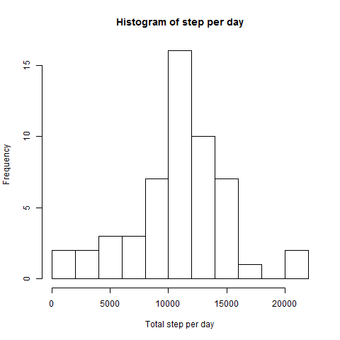

## As the first step
Loading necessary libraries to be used later steps & set locale

```r
library(dplyr)
library(lattice)
Sys.setlocale("LC_TIME", "English")
```

## Loading and preprocessing the data
### Load the data  
Unzip "repdate_data_activity.zip" (please locate the same working directory where the R script runs) and read the csv file inside it

```r
activity <- read.csv(unzip("repdata_data_activity.zip"))
```

### Process/transform the data (if necessary) into a format suitable for your analysis
Convert "date" column from character to date data type

```r
activity$date <- as.Date(activity$date)
```

## (Part1) What is mean total number of steps taken per day?
### Calculate the total number of steps taken per day  
Using "dplyr" library

1. Filter "NA" step rows
1. Group by date column
1. Summarize with total steps by date

```r
daily_activity <- activity %>% 
        filter(!is.na(steps)) %>% 
        group_by(date) %>% 
        summarise(steps=sum(steps))
```

### Make a histogram of the total number of steps taken each day  

```r
hist(daily_activity$steps, main = "Histogram of step per day", 
     xlab = "Total step per day", breaks = 10)
```

 

### Calculate and report the mean and median of the total number of steps taken per day

```r
mean(daily_activity$steps)
```

```
## [1] 10766.19
```

```r
median(daily_activity$steps)
```

```
## [1] 10765
```
The median is less than the mean. 

## (Part2) What is the average daily activity pattern?
### Make a time series plot (i.e. type = "l") of the 5-minute interval (x-axis) and the average number of steps taken, averaged across all days (y-axis)  
Using "dplyr" library

1. Filter "NA" step rows
1. Group by interval column
1. Summarize with calculate average steps by interval
Then plot the data with line (type="l")

```r
by_interval_activity <- activity %>% 
        filter(!is.na(steps)) %>% 
        group_by(interval) %>% 
        summarise(average_steps=mean(steps))
plot(x = by_interval_activity$interval, y = by_interval_activity$average_steps, 
     type="l", xlab = "Interval", ylab = "Average Steps", 
     main = "Average steps for each interval across all days")
```

 

### Which 5-minute interval, on average across all the days in the dataset, contains the maximum number of steps?

```r
by_interval_activity[by_interval_activity$average_steps==max(by_interval_activity$average_steps),]
```

```
## Source: local data frame [1 x 2]
## 
##   interval average_steps
##      (int)         (dbl)
## 1      835      206.1698
```
Interval#835(8:35am) contains the maximum number of average steps (206steps) 

## (Part3) Imputing missing values
### Calculate and report the total number of missing values in the dataset (i.e. the total number of rows with NAs)

```r
nrow(activity[is.na(activity$step),])
```

```
## [1] 2304
```
### Devise a strategy for filling in all of the missing values in the dataset.
### Create a new dataset that is equal to the original dataset but with the missing data filled in.
Here, I chose to insert by the mean of the 5 interval. (In case of inserting the mean of the day, there are some days where the steps are NA for all intervals)

1. Merge activity data and by-interval average data (which was created in the 2nd part of the assignment)
1. Replace "steps" column with "average_steps" column where "steps" is NA

```r
newActivity <- merge(activity, by_interval_activity, by.x = "interval", by.y = "interval")
newActivity[is.na(newActivity$steps),]$steps <- newActivity[is.na(newActivity$steps),]$average_steps
newActivity <- select(newActivity, steps, interval, date)
```

### Make a histogram of the total number of steps taken each day and Calculate and report the mean and median total number of steps taken per day.
Using "dplyr" library (no longer need to filter is.na(steps) rows)

1. Group by date column
1. Summarize with total steps by date

```r
daily_activity <- newActivity %>% 
        group_by(date) %>% 
        summarise(total_steps=sum(steps))
```

Create histogram

```r
hist(daily_activity$total_steps, main = "Histogram of Total step per day", 
     xlab = "Total step per day", breaks = 10)
```

 

Calculate mean and median

```r
mean(daily_activity$total_steps)
```

```
## [1] 10766.19
```

```r
median(daily_activity$total_steps)
```

```
## [1] 10766.19
```
### Do these values differ from the estimates from the first part of the assignment? What is the impact of imputing missing data on the estimates of the total daily number of steps?  

* No impact on the mean.  
* Per the histogram, more frequncy is observed around the center  
* The median gets equal to the mean  

## (Part4) Are there differences in activity patterns between weekdays and weekends?

### Create a new factor variable in the dataset with two levels: "weekday" and "weekend" indicating whether a given date is a weekday or weekend day.  

1. Using "dplyr" library, mutate activity dataframe to have "flag" column (TRUE for weekends, FALSE for weekdays)
1. add "weekends_weekdays" column
1. update "weekends_weekdays" column with "weekend" if "flag" column is TRUE or "weekday" if FALSE

```r
activity <- activity %>% mutate(flag = weekdays(date) %in% c("Saturday","Sunday"))
activity <- cbind(activity,weekends_weekdays=NA)
activity[activity$flag,]$weekends_weekdays <- "weekend"
activity[!activity$flag,]$weekends_weekdays <- "weekday"
```
### Make a panel plot containing a time series plot (i.e. type = "l") of the 5-minute interval (x-axis) and the average number of steps taken, averaged across all weekday days or weekend days (y-axis).
Using "dplyr" library  

1. Filter "NA" step rows  
1. Group by interval and weekends_weekdays columns  
1. Summarize with total steps by interval, weekends_weekdays  

```r
activity_analysis <- activity %>%
        filter(!is.na(steps)) %>% 
        group_by(interval, weekends_weekdays) %>% 
        summarise(average_steps=mean(steps))
```

For plotting, using xyplot from "lattice" library  

```r
xyplot(average_steps ~ interval | weekends_weekdays, data = activity_analysis, 
       layout = c(1, 2), type = "l", ylab = "Number of steps")
```

 

A few observations from the above plot  

* The activity of weekday starts and ends earlier than weekend
* The higher activity at weekday morning (commution?)
* Overall daytime activity is higher for weekend than weekday (weekend activity?)
